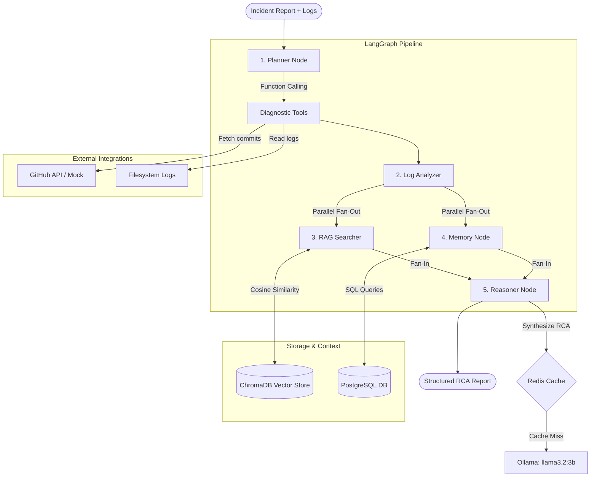

# Sentinel AI 🛡️

An Autonomous Incident Investigation Platform powered by a multi-agent AI pipeline. Paste a log file and incident description — Sentinel investigates it like a senior engineer would, producing a structured Root Cause Analysis report in minutes.


---

## What it does

When a production incident happens, developers manually check logs, cross-reference GitHub commits, query databases, and search past incidents — all while the system is down. Sentinel automates this entire process.

**Input:** incident description + log content  
**Output:** severity, root cause, evidence, immediate actions, confidence score

---

## Architecture & Multi-Agent Pipeline

Sentinel coordinates five specialized agents using **LangGraph** to build a state-driven execution DAG:



### Detailed Agent Lifecycle & Data Flow

1. **Planner**: Performs LLM-driven function calling to identify which diagnostic tools are needed. It automatically determines whether to run `search_github_commits` (to fetch recent deployment commits), `query_incidents_db` (for historical metadata), or `read_log_file` (sandboxed filesystem reader).
2. **Log Analyzer**: Performs a structured first-pass analysis of the logs to isolate error patterns, timelines, affected components, and critical indicators.
3. **RAG Searcher (Parallel)**: Implements **Two-Pass RAG**. Using structured components from the Log Analyzer, it constructs a search embedding using `nomic-embed-text` and queries **ChromaDB** with a strict cosine similarity threshold ($\ge 0.92$) to retrieve similar past incidents.
4. **Memory (Parallel)**: Consults **PostgreSQL** to fetch historical service statistics (common causes, successful fixes) and retrieves proven, high-confidence runbooks.
5. **Reasoner**: Combines all evidence items (each tagged with its source: `[CURRENT LOG]`, `[PAST INCIDENT]`, `[MEMORY]`). It performs a final synthesized LLM pass to output a structured JSON report specifying severity, affected service, probable cause, log-grounded evidence, and immediate remediation steps.

---

## Tech Stack

- **Frontend:** Next.js (React 19) · Tailwind CSS 4
- **Backend:** FastAPI (Python 3.13) · LangGraph · LangChain
- **LLM & Embeddings:** Ollama (`llama3.2:3b` & `nomic-embed-text`)
- **Storage:** PostgreSQL 16 (Relational/Memory) · ChromaDB (Vector embeddings) · Redis 7 (LLM Cache)
- **Infra:** Docker Compose · GitHub Actions CI

---

## Key Engineering Decisions

* **Two-Pass RAG**: Raw logs are noisy and contain non-standard vocabulary. The system runs a structured log analysis first (first pass), then embeds the structured findings (service name, error type, severity) to query ChromaDB for past incidents (second pass). This produces highly accurate semantic matches.
* **Evidence Source Labeling**: To prevent the Reasoner from copying conclusions from similar past incidents, every evidence piece is explicitly prefixed (`[CURRENT LOG]`, `[PAST INCIDENT]`, `[MEMORY]`). The Reasoner prompt is structured to strictly prioritize current log evidence while treating history as reference context.
* **Auto-Runbook Generation**: If an investigation finishes with a confidence score of $\ge 0.85$, the platform automatically compiles the resolution actions into a runbook inside PostgreSQL, facilitating instant retrieval for future incidents.
* **Dual-Database Strategy**: ChromaDB handles semantic queries ("find incidents with similar error profiles"), while PostgreSQL handles structured query criteria ("show incidents by severity/service over time").
* **Fail-Safe Orchestration**: If downstream APIs (like GitHub or Redis) fail, the backend degrades gracefully using simulated fallbacks and bypasses cache/tools without breaking the core agent pipeline.


---

## Evaluation

Built a custom evaluation framework with four scoring dimensions:

| Dimension | Method |
|---|---|
| Rule-based | Severity match, service match, keyword presence |
| Evidence grounding | Are evidence items traceable to actual log lines? |
| Semantic similarity | Embedding-based comparison vs expected root cause |
| LLM-as-judge | Separate LLM scores accuracy, completeness, actionability |

**Current scores:** 3/3 test cases passing · avg score 0.786

---

## Getting started

**Prerequisites:** Docker Desktop · Ollama · Python 3.11+ · Node.js 18+

```bash
# 1. Clone
git clone https://github.com/YOUR_USERNAME/sentinel-ai.git
cd sentinel-ai

# 2. Pull models
ollama pull llama3.2:3b
ollama pull nomic-embed-text

# 3. Start infrastructure
docker-compose up -d

# 4. Backend
python -m venv venv
venv\Scripts\activate
pip install -r requirements.txt
uvicorn backend.main:app --reload --port 8000

# 5. Frontend
cd frontend
npm install
npm run dev
```

Open `http://localhost:3000`  
Login: `rahul` / `sentinel123`

---

## Project structure

```
sentinel-ai/
├── backend/
│   ├── agents/          # LangGraph nodes and graph definition
│   ├── core/            # Config, database, auth, cache
│   ├── evaluation/      # Test cases and scoring framework
│   ├── routers/         # FastAPI route handlers
│   ├── services/        # LLM, vector, memory, function calling
│   └── tools/           # GitHub, PostgreSQL, filesystem tools
├── frontend/
│   ├── app/             # Next.js app router pages
│   ├── components/      # React components
│   └── lib/             # API client
└── docker-compose.yml
```

---


Built by [Rahul Joshi](https://github.com/YOUR_USERNAME) · MCA @ MIT ADT University