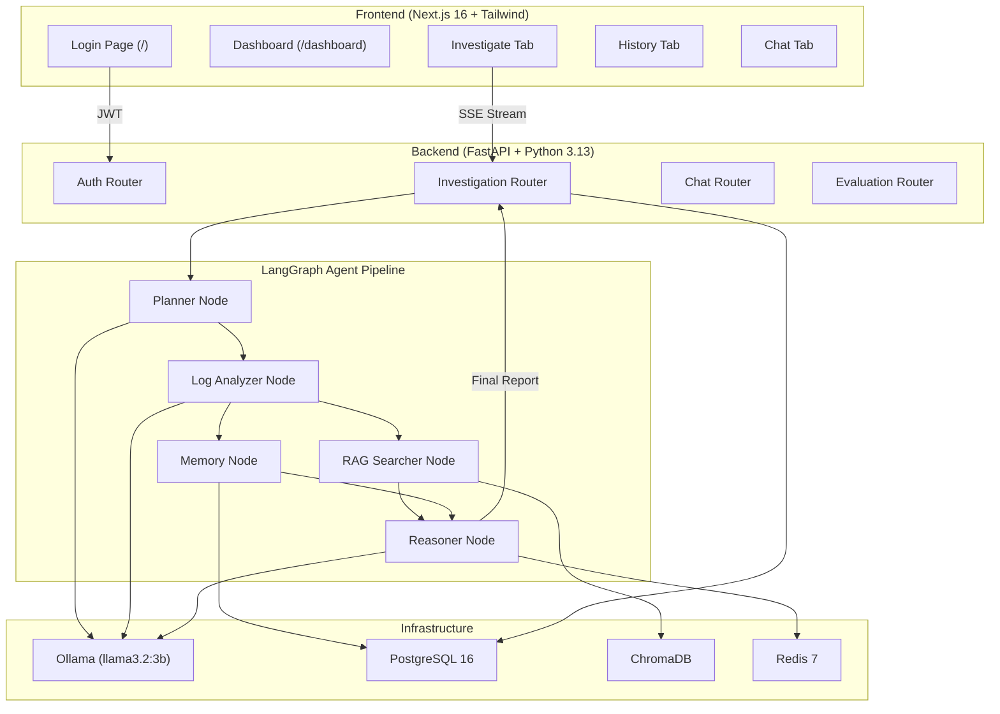

# Sentinel AI — Complete Codebase Deep Dive

## 1. What Is This Project?

Sentinel AI is an **Autonomous Incident Investigation Platform**. When a production incident occurs (e.g., a payment service crashing), an engineer pastes the incident description and raw log content into the dashboard. Sentinel then runs a **multi-agent AI pipeline** that mimics what a senior SRE would do: analyze the logs, search for similar past incidents, check GitHub for recent commits, consult historical memory, and synthesize everything into a structured Root Cause Analysis (RCA) report — all automatically, in minutes.

**Input:** Incident description + raw log content  
**Output:** Severity, root cause, evidence, fix steps, confidence score

---

## 2. High-Level Architecture



---

## 3. Technology Stack — Detailed

| Layer | Technology | Purpose |
|-------|-----------|---------|
| **Frontend** | Next.js 16, React 19, Tailwind CSS 4 | SPA with App Router, JWT auth, SSE streaming |
| **Backend** | FastAPI, Python 3.13, Pydantic | REST API with async endpoints, data validation |
| **AI Orchestration** | LangGraph, LangChain | Stateful multi-agent DAG execution |
| **LLM** | Ollama (llama3.2:3b local) | All inference — analysis, function calling, reasoning, evaluation |
| **Embeddings** | nomic-embed-text (via Ollama) | Text → vector for semantic search |
| **Vector DB** | ChromaDB (persistent, cosine) | Stores/searches past incident embeddings |
| **Relational DB** | PostgreSQL 16 (async via SQLAlchemy) | Incidents, tool calls, service memory, runbooks |
| **Cache** | Redis 7 | LLM response caching with TTL |
| **Auth** | JWT (python-jose) + bcrypt (passlib) | Bearer token auth, 24-hour expiry |
| **Containerization** | Docker Compose | PostgreSQL + Redis + Backend in containers |

---

## 4. Project Structure — File by File

```
sentinel-ai/
├── .env                          # All config: Ollama, DB, Redis, JWT, GitHub
├── Dockerfile                    # Python 3.13 slim, uvicorn entrypoint
├── docker-compose.yml            # Postgres + Redis + Backend
├── requirements.txt              # Python dependencies
│
├── backend/
│   ├── main.py                   # FastAPI app setup, CORS, startup, router mounts
│   │
│   ├── core/
│   │   ├── config.py             # Pydantic Settings (env loading)
│   │   ├── database.py           # SQLAlchemy async engine, ORM models, init_db()
│   │   ├── auth.py               # JWT creation/verification, hardcoded users
│   │   └── cache.py              # Redis client, get/set/stats with MD5 key hashing
│   │
│   ├── models/
│   │   └── schemas.py            # Pydantic models: InvestigationReport, SimilarIncident, etc.
│   │
│   ├── services/
│   │   ├── llm_service.py        # Ollama HTTP calls: stream, analyze_log, analyze_with_context
│   │   ├── vector_service.py     # ChromaDB: store_incident, search_similar, generate_embedding
│   │   ├── memory_service.py     # PostgreSQL: get/update service memory + auto-runbook creation
│   │   ├── function_calling_service.py  # LLM-driven tool selection + execution
│   │   └── log_service.py        # Raw bytes → truncated UTF-8 text
│   │
│   ├── tools/
│   │   ├── registry.py           # Tool definitions (JSON schema) + dispatcher
│   │   ├── github_tool.py        # GitHub API / mock commits search
│   │   ├── database_tool.py      # PostgreSQL incident query + save
│   │   └── filesystem_tool.py    # Sandboxed log file reader
│   │
│   ├── agents/
│   │   ├── state.py              # InvestigationState TypedDict (LangGraph state schema)
│   │   ├── graph.py              # LangGraph DAG: planner → log_analyzer → [rag + memory] → reasoner
│   │   └── nodes.py              # All 5 agent node implementations
│   │
│   ├── routers/
│   │   ├── auth.py               # POST /api/auth/login, GET /api/auth/me
│   │   ├── chat.py               # POST /api/chat (streaming)
│   │   ├── investigation.py      # POST run/run-stream, GET list/detail/frequency/cache-stats
│   │   └── evaluation.py         # POST run/report, GET latest/test-cases
│   │
│   └── evaluation/
│       ├── test_cases.py          # 3 curated test scenarios with ground truth
│       ├── evaluator.py           # 4-dimension scoring framework
│       └── last_results.json      # Cached evaluation output (avg 0.795)
│
└── frontend/
    ├── package.json               # Next.js 16 + React 19 + Tailwind 4
    ├── app/
    │   ├── layout.tsx             # Root layout (Geist fonts)
    │   ├── globals.css            # Global styles
    │   ├── page.tsx               # Login page (/)
    │   └── dashboard/
    │       └── page.tsx           # Main dashboard with 3 tabs (662 lines)
    └── lib/
        └── api.ts                 # API client: all fetch calls + SSE parser
```

---

## 5. The Complete Investigation Flow — Step by Step

This is the core of the entire system. Here's exactly what happens from the moment a user clicks "Run Investigation" to the final report:

### Step 1: Frontend Initiates SSE Stream

[page.tsx](file:///c:/Users/joshi/Documents/Projects/sentinel-ai/frontend/app/dashboard/page.tsx#L164-L182) → `handleInvestigate()` calls [api.runInvestigationStream()](file:///c:/Users/joshi/Documents/Projects/sentinel-ai/frontend/lib/api.ts#L47-L113).

- Opens a `fetch()` to `POST /api/investigation/run-stream` with `incident_description` and `log_content`
- The response is an **SSE (Server-Sent Events) stream**
- Three event types: `progress` (real-time agent updates), `result` (final report), `error`
- A manual SSE parser reads chunks from `ReadableStream`, splits by `\n`, and dispatches events via callbacks

### Step 2: Backend Creates Investigation State

[investigation.py](file:///c:/Users/joshi/Documents/Projects/sentinel-ai/backend/routers/investigation.py#L74-L145) → `run_investigation_stream()`:

- Generates a UUID `investigation_id`
- Creates an `asyncio.Queue()` for progress events
- Builds the initial [InvestigationState](file:///c:/Users/joshi/Documents/Projects/sentinel-ai/backend/agents/state.py#L4-L24) dict
- Spawns the LangGraph execution as a **background `asyncio.Task`**
- Returns a `StreamingResponse` that reads from the queue and yields SSE events

### Step 3: LangGraph DAG Executes

The compiled graph in [graph.py](file:///c:/Users/joshi/Documents/Projects/sentinel-ai/backend/agents/graph.py#L12-L43) defines this execution order:

```
planner → log_analyzer → [rag_searcher ∥ memory] → reasoner → END
```

> [!IMPORTANT]
> `rag_searcher` and `memory` run **in parallel** after `log_analyzer`. Both must complete before `reasoner` starts. This is LangGraph's automatic fan-out/fan-in from the two edges out of `log_analyzer`.

### Step 4: Planner Node

[nodes.py L84-L143](file:///c:/Users/joshi/Documents/Projects/sentinel-ai/backend/agents/nodes.py#L84-L143)

The Planner does **LLM-driven function calling**:

1. Calls [run_function_calling()](file:///c:/Users/joshi/Documents/Projects/sentinel-ai/backend/services/function_calling_service.py#L6-L104) which:
   - Sends the incident description + log preview to Ollama along with the [TOOL_DEFINITIONS](file:///c:/Users/joshi/Documents/Projects/sentinel-ai/backend/tools/registry.py#L6-L63) JSON schema
   - The LLM returns a JSON object specifying which tools to call and with what arguments
   - If the LLM fails to produce valid JSON, falls back to `search_github_commits` + `query_incidents_db`
2. Executes each selected tool via [execute_tool()](file:///c:/Users/joshi/Documents/Projects/sentinel-ai/backend/tools/registry.py#L72-L92)
3. Converts tool results into labeled evidence items (e.g. `[GITHUB COMMIT]`, `[SIMULATED COMMIT]`)

**Available tools:**

| Tool | File | What It Does |
|------|------|-------------|
| `search_github_commits` | [github_tool.py](file:///c:/Users/joshi/Documents/Projects/sentinel-ai/backend/tools/github_tool.py) | Searches for recent commits; has realistic mock data for `payment-service`, `order-service`, `auth-service` |
| `query_incidents_db` | [database_tool.py](file:///c:/Users/joshi/Documents/Projects/sentinel-ai/backend/tools/database_tool.py#L5-L58) | Queries PostgreSQL `incidents` table by service name (ILIKE) |
| `read_log_file` | [filesystem_tool.py](file:///c:/Users/joshi/Documents/Projects/sentinel-ai/backend/tools/filesystem_tool.py) | Reads from whitelisted directories only (`./logs`, `./data/logs`, `C:/logs`) |

### Step 5: Log Analyzer Node

[nodes.py L147-L192](file:///c:/Users/joshi/Documents/Projects/sentinel-ai/backend/agents/nodes.py#L147-L192)

- Sends the first 1000 chars of log content to Ollama with a structured prompt
- Asks for JSON with: `error_patterns`, `timeline`, `affected_components`, `severity_indicators`
- Uses [call_llm_with_retry()](file:///c:/Users/joshi/Documents/Projects/sentinel-ai/backend/agents/nodes.py#L38-L67) — **3 retry attempts** with JSON cleaning
- Produces evidence items tagged with `[CURRENT LOG]` prefix
- If no log content provided, marks itself as failed and returns empty findings

### Step 6: RAG Searcher Node (parallel with Memory)

[nodes.py L196-L250](file:///c:/Users/joshi/Documents/Projects/sentinel-ai/backend/agents/nodes.py#L196-L250)

This is the **Two-Pass RAG** architecture:

1. Takes the structured `log_findings` from the Log Analyzer (the "first pass")
2. Constructs a temporary `InvestigationReport` object using those findings
3. Calls [search_similar_incidents()](file:///c:/Users/joshi/Documents/Projects/sentinel-ai/backend/services/vector_service.py#L66-L136) which:
   - Builds a composite text: `"Service: X, Cause: Y, Severity: Z, Log excerpt: ..."`
   - Generates an embedding via Ollama's `nomic-embed-text` model
   - Queries ChromaDB with cosine similarity
   - Filters results with a **0.92 similarity threshold** (intentionally strict)
   - Self-exclusion: skips the current investigation ID
4. Produces evidence items tagged with `[PAST INCIDENT]`

> [!NOTE]
> **Why Two-Pass RAG?** You can't search ChromaDB meaningfully with raw logs. The first LLM pass extracts structured fields (service name, error type), which are then embedded to find semantically similar incidents.

### Step 7: Memory Node (parallel with RAG)

[nodes.py L334-L386](file:///c:/Users/joshi/Documents/Projects/sentinel-ai/backend/agents/nodes.py#L334-L386)

Dual responsibility:

1. **Retrieve**: Calls [get_service_memory()](file:///c:/Users/joshi/Documents/Projects/sentinel-ai/backend/services/memory_service.py#L7-L61) to fetch from PostgreSQL:
   - `service_memory` table: total incidents, common causes, successful fixes, peak times
   - `runbooks` table: proven resolution steps ordered by confidence and usage count
2. **Update** (if `final_report` has a known service): Calls [update_service_memory()](file:///c:/Users/joshi/Documents/Projects/sentinel-ai/backend/services/memory_service.py#L63-L159):
   - Upserts into `service_memory` (increments count, appends new causes/fixes, caps at 10/20)
   - Auto-creates a runbook if `confidence >= 0.85`
3. Produces evidence tagged with `[MEMORY]`

> [!NOTE]
> In `EVAL_MODE`, the memory node is **short-circuited** to prevent test runs from polluting the memory store.

### Step 8: Reasoner Node

[nodes.py L254-L331](file:///c:/Users/joshi/Documents/Projects/sentinel-ai/backend/agents/nodes.py#L254-L331)

The synthesis engine:

1. **Cache check**: Creates a deterministic key from `incident_description + log_content` via MD5. If Redis has a cached report, returns immediately
2. **Evidence separation**: Splits all accumulated evidence into three categories:
   - `[CURRENT LOG]` — primary source, highest weight
   - `[PAST INCIDENT]` + `[MEMORY]` — reference only
   - Other — tool outputs, metadata
3. **Structured prompt**: Explicitly tells the LLM to base its conclusion on current log evidence and NOT copy historical conclusions (this was the key fix that improved scores from 0.627 → 0.786)
4. **LLM call**: Requests JSON with: severity, affected_service, probable_cause, evidence (from current log), immediate_actions, confidence, investigation_summary
5. **Cache set**: Stores result in Redis with 1-hour TTL

### Step 9: Post-Processing & Persistence

Back in [investigation.py](file:///c:/Users/joshi/Documents/Projects/sentinel-ai/backend/routers/investigation.py#L108-L144):

1. **Save to PostgreSQL**: Calls [save_incident_to_db()](file:///c:/Users/joshi/Documents/Projects/sentinel-ai/backend/tools/database_tool.py#L60-L109) — stores the full report in the `incidents` table
2. **Update memory**: Calls `update_service_memory()` again from the router level (note: this is a **duplicate call** — memory_node already does this)
3. **Stream final result**: Yields the complete result as an `event: result` SSE event
4. Frontend receives it, closes the stream, and renders the report

---

## 6. Database Schema (PostgreSQL)

Defined in [database.py](file:///c:/Users/joshi/Documents/Projects/sentinel-ai/backend/core/database.py#L19-L68):

### `incidents` table
| Column | Type | Description |
|--------|------|-------------|
| `id` | String (PK) | UUID from investigation |
| `description` | Text | Original incident description |
| `log_content` | Text | Raw log (truncated to 2000 chars) |
| `severity` | String | critical / high / medium / low |
| `affected_service` | String | Service name |
| `probable_cause` | Text | Root cause from Reasoner |
| `evidence` | JSON | List of evidence strings |
| `immediate_actions` | JSON | List of fix steps |
| `confidence` | Float | 0.0–1.0 |
| `investigation_summary` | Text | Two-sentence summary |
| `tools_completed` | JSON | List of agent names that succeeded |
| `tools_failed` | JSON | List of agent names that failed |
| `created_at` | DateTime | Timestamp |

### `tool_calls` table
| Column | Type | Description |
|--------|------|-------------|
| `id` | String (PK) | UUID |
| `investigation_id` | String | FK to incidents |
| `tool_name` | String | Which tool was called |
| `arguments` | JSON | Arguments passed |
| `result_summary` | Text | Summary of result |
| `success` | String | Success indicator |
| `created_at` | DateTime | Timestamp |

### `service_memory` table
| Column | Type | Description |
|--------|------|-------------|
| `id` | String (PK) | UUID |
| `service_name` | String (unique) | e.g. "payment-service" |
| `total_incidents` | Integer | Running count |
| `common_causes` | JSON | List of cause strings (max 10) |
| `successful_fixes` | JSON | List of fix strings (max 20) |
| `peak_incident_times` | JSON | When incidents cluster |
| `last_updated` | DateTime | Last update |

### `runbooks` table
| Column | Type | Description |
|--------|------|-------------|
| `id` | String (PK) | UUID |
| `service_name` | String | Service this applies to |
| `trigger_pattern` | Text | What triggers this runbook (probable_cause) |
| `resolution_steps` | JSON | Proven fix steps |
| `confidence` | Float | How reliable (≥0.85 to create) |
| `times_used` | Integer | Usage counter |
| `created_at` | DateTime | Creation time |
| `last_used` | DateTime | Last usage |

---

## 7. ChromaDB Vector Store

Defined in [vector_service.py](file:///c:/Users/joshi/Documents/Projects/sentinel-ai/backend/services/vector_service.py):

- **Collection**: `incidents` with cosine distance metric (`hnsw:space: cosine`)
- **Persistence**: Disk at `./data/chroma`
- **Embedding model**: `nomic-embed-text` via Ollama API
- **What gets embedded**: A composite string: `"Service: X, Cause: Y, Severity: Z, Log excerpt: {first 500 chars}"`
- **What gets stored**: Full log content (first 1000 chars) as document, plus metadata (service, cause, severity, actions, timestamp)
- **Search threshold**: `similarity_score >= 0.92` — this is deliberately high to avoid cross-service false positives from shared SRE vocabulary

---

## 8. Caching Layer (Redis)

Defined in [cache.py](file:///c:/Users/joshi/Documents/Projects/sentinel-ai/backend/core/cache.py):

- **Key format**: `sentinel:{prefix}:{md5(content)}` — deterministic, so identical inputs always hit cache
- **Two cache points**:
  1. `log_analysis` — in [llm_service.py L52-L56](file:///c:/Users/joshi/Documents/Projects/sentinel-ai/backend/services/llm_service.py#L52-L56): caches the `analyze_log()` result
  2. `reasoner_report` — in [nodes.py L255-L265](file:///c:/Users/joshi/Documents/Projects/sentinel-ai/backend/agents/nodes.py#L255-L265): caches the final synthesized report
- **TTL**: 3600 seconds (1 hour)
- **Hit/miss tracking**: Increments `sentinel:stats:hits` and `sentinel:stats:misses` counters
- **Fail-safe**: All cache operations silently swallow exceptions — cache failures never break the application

---

## 9. Authentication System

### Backend ([auth.py](file:///c:/Users/joshi/Documents/Projects/sentinel-ai/backend/core/auth.py))

- **Hardcoded users** (v0.9 planned for proper user management):
  - `rahul` / `sentinel123` → role: `admin`
  - `demo` / `demo123` → role: `viewer`
- Password hashing: `bcrypt` via `passlib`
- Token: JWT with HS256, 24-hour expiry
- Payload: `{"sub": username, "exp": timestamp}`
- Protection: `get_current_user` dependency injected into every protected endpoint via `Depends(security)` using `HTTPBearer`

### Frontend ([page.tsx](file:///c:/Users/joshi/Documents/Projects/sentinel-ai/frontend/app/page.tsx))

- Login form posts to `/api/auth/login`
- Stores `token` and `username` in `localStorage`
- Dashboard checks for token on mount; redirects to `/` if missing
- All API calls include `Authorization: Bearer {token}` header

---

## 10. Evaluation Framework

### Test Cases ([test_cases.py](file:///c:/Users/joshi/Documents/Projects/sentinel-ai/backend/evaluation/test_cases.py))

3 curated scenarios:

| ID | Name | Service | Expected Severity |
|----|------|---------|-------------------|
| tc_001 | Database connection pool exhaustion | payment-service | high |
| tc_002 | Out of memory error | order-service | critical |
| tc_003 | Authentication service timeout | auth-service | high |

Each test case includes: realistic log content, expected severity/service, cause keywords, evidence keywords, action keywords.

### Scoring Dimensions ([evaluator.py](file:///c:/Users/joshi/Documents/Projects/sentinel-ai/backend/evaluation/evaluator.py))

| Dimension | Weight | How It Works |
|-----------|--------|-------------|
| **Rule-based** | 25% | Exact match on severity, fuzzy match on service name, keyword presence in cause and actions, confidence range check (0.5–1.0) |
| **Evidence grounding** | 25% | For each evidence item, extracts words >4 chars, checks if ≥30% appear in the actual log content. Penalizes hallucinated evidence |
| **Semantic similarity** | 25% | Embeds expected cause keywords and actual cause via nomic-embed-text, computes cosine similarity |
| **LLM-as-judge** | 25% | Separate LLM call scores accuracy, completeness, actionability on 0.0–1.0 scale each, averages them |

**Pass threshold**: Overall score ≥ 0.70

### Two Evaluation Modes

1. **Full suite** (`POST /api/evaluation/run`): Runs all 3 test cases through the complete pipeline, scores each, computes averages. Sets `EVAL_MODE=true` to disable memory writes. Results cached to [last_results.json](file:///c:/Users/joshi/Documents/Projects/sentinel-ai/backend/evaluation/last_results.json)
2. **Single report** (`POST /api/evaluation/report`): Takes a real investigation report + log content, scores using only evidence grounding + LLM-as-judge (no ground truth needed). Used by the dashboard "Evaluate Report" button

### Latest Results

| Test Case | Rule | Evidence | Semantic | LLM | Overall |
|-----------|------|----------|----------|-----|---------|
| DB connection pool | 0.867 | 1.000 | 0.776 | 0.800 | **0.861** ✅ |
| Out of memory | 0.783 | 1.000 | 0.803 | 0.500 | **0.771** ✅ |
| Auth timeout | 0.867 | 1.000 | 0.645 | 0.500 | **0.753** ✅ |
| **Average** | **0.839** | **1.000** | **0.741** | **0.600** | **0.795** |

---

## 11. Frontend Architecture

### Pages

| Route | File | Purpose |
|-------|------|---------|
| `/` | [page.tsx](file:///c:/Users/joshi/Documents/Projects/sentinel-ai/frontend/app/page.tsx) | Login page with dark theme |
| `/dashboard` | [dashboard/page.tsx](file:///c:/Users/joshi/Documents/Projects/sentinel-ai/frontend/app/dashboard/page.tsx) | Main SPA with 3 tabs |

### Dashboard Tabs

#### 🔍 Investigate Tab (Lines 264–445)
- Form: Incident description (required) + Log content (optional)
- On submit: Opens SSE stream, shows real-time agent pipeline logs with status icons (● running, ✔ completed, ✘ failed)
- Result display: Severity badge, affected service, probable cause, confidence %, evidence list, actions list, metadata
- "Evaluate Report" button: Calls `/api/evaluation/report` and shows evidence grounding + LLM judge scores with animated progress bars

#### 📋 History Tab (Lines 448–630)
- **Frequency chart**: CSS bar chart of daily incident counts (last 14 days), hover to see count
- **Filters**: Dropdowns for severity and service
- **Split layout**: Left panel lists investigations (scrollable), right panel shows full detail of selected investigation
- Loads data from `GET /api/investigations` + `GET /api/investigations/frequency`

#### 💬 Chat Tab (Lines 632–658)
- Simple streaming chat with Ollama via `POST /api/chat`
- Reads `ReadableStream` chunk-by-chunk, appends to display in real-time
- Monospace font, dark terminal aesthetic

### API Client ([api.ts](file:///c:/Users/joshi/Documents/Projects/sentinel-ai/frontend/lib/api.ts))

A plain object with 10 async methods:

| Method | Endpoint | Notes |
|--------|----------|-------|
| `login()` | POST `/api/auth/login` | Returns JWT |
| `runInvestigation()` | POST `/api/investigation/run` | Non-streaming (unused in dashboard) |
| `streamChat()` | POST `/api/chat` | Returns ReadableStream |
| `runInvestigationStream()` | POST `/api/investigation/run-stream` | Manual SSE parser with callbacks |
| `getInvestigations()` | GET `/api/investigations` | With optional severity/service filters |
| `getInvestigationById()` | GET `/api/investigations/{id}` | Full detail |
| `getInvestigationFrequency()` | GET `/api/investigations/frequency` | Last 30 days |
| `getLatestEvaluation()` | GET `/api/evaluation/latest` | Cached results |
| `runEvaluation()` | POST `/api/evaluation/run` | Full test suite |
| `evaluateReport()` | POST `/api/evaluation/report` | Single report scoring |

---

## 12. API Endpoints — Complete Reference

| Method | Path | Auth | Description |
|--------|------|------|-------------|
| POST | `/api/auth/login` | ❌ | Login, returns JWT |
| GET | `/api/auth/me` | ✅ | Current user info |
| POST | `/api/chat` | ✅ | Streaming chat |
| POST | `/api/investigation/run` | ✅ | Run investigation (blocking) |
| POST | `/api/investigation/run-stream` | ✅ | Run investigation (SSE stream) |
| GET | `/api/investigation/cache-stats` | ✅ | Redis hit/miss stats |
| GET | `/api/investigations` | ✅ | List past investigations (filterable) |
| GET | `/api/investigations/frequency` | ✅ | Daily counts for last 30 days |
| GET | `/api/investigations/{id}` | ✅ | Single investigation detail |
| POST | `/api/evaluation/run` | ✅ | Run full evaluation suite |
| POST | `/api/evaluation/report` | ✅ | Evaluate a single report |
| GET | `/api/evaluation/latest` | ✅ | Get cached evaluation results |
| GET | `/api/evaluation/test-cases` | ❌ | List test case IDs/names |
| GET | `/health` | ❌ | Health check |

---

## 13. Key Design Decisions Explained

### Two-Pass RAG
You can't embed raw logs meaningfully — they're noisy and lack structure. So the system does a **first pass** (Log Analyzer) to extract structured findings (service name, error patterns, severity), then uses those structured findings to create a high-quality embedding for the **second pass** (RAG search in ChromaDB). This produces much better semantic matches.

### Evidence Source Labeling
Early versions scored avg 0.627 because the Reasoner was copying conclusions from past incidents instead of reasoning from current logs. The fix: tag every evidence item with its source — `[CURRENT LOG]`, `[PAST INCIDENT]`, `[MEMORY]` — and restructure the Reasoner prompt to explicitly prioritize current evidence. Score improved to 0.786.

### Similarity Threshold 0.92
From observed data:
- Same failure pattern (DB pool vs DB pool): 0.93–0.95 → **pass**
- Different failure type (Redis vs DB pool): 0.86–0.89 → **fail**

The threshold intentionally ignores service name: a DB pool exhaustion on payment-service IS useful context for the same issue on user-service.

### PostgreSQL + ChromaDB Dual Storage
They serve different purposes:
- **ChromaDB**: "Find incidents that _mean_ the same thing" (semantic similarity)
- **PostgreSQL**: "Show all critical incidents from last week" (structured queries, filtering, aggregation)

### Auto-Runbook Generation
When an investigation completes with confidence ≥ 0.85, the system automatically creates a runbook entry in PostgreSQL linking the trigger pattern (probable cause) to the proven resolution steps. Future investigations for the same service will find and surface these runbooks via the Memory node.

### Graceful Degradation
Every tool, service, and cache operation is wrapped in try/except. If GitHub API fails, it falls back to simulated commits. If Redis fails, it skips caching. If an agent node fails, it adds itself to `failed_tools` but doesn't crash the pipeline. The Reasoner always produces _some_ output, even if it's a fallback "Manual investigation required" response.

---

## 14. Infrastructure & Deployment

### Docker Compose ([docker-compose.yml](file:///c:/Users/joshi/Documents/Projects/sentinel-ai/docker-compose.yml))

Three services:
1. **postgres** (port 5433→5432): With health check, persistent volume
2. **redis** (port 6379): Alpine image, persistent volume, health check
3. **backend** (port 8000): Built from Dockerfile, depends on healthy postgres + redis, connects to Ollama on host machine via `host.docker.internal`

### Dockerfile ([Dockerfile](file:///c:/Users/joshi/Documents/Projects/sentinel-ai/Dockerfile))
- Base: `python:3.13-slim`
- Installs deps, copies source, creates chroma directory
- Runs: `uvicorn backend.main:app --host 0.0.0.0 --port 8000`

### Local Dev Setup
1. Ollama running locally with `llama3.2:3b` and `nomic-embed-text` models
2. `docker-compose up -d` for Postgres + Redis
3. `uvicorn backend.main:app --reload --port 8000` for backend
4. `cd frontend && npm run dev` for frontend

---

## 15. Data Flow Summary

```
User Input (description + log)
    │
    ▼
┌─ Planner ──────────────────────────────┐
│  LLM selects tools → executes them     │
│  GitHub commits, DB history, log files  │
│  Output: evidence[], github_commits[]  │
└────────────┬───────────────────────────┘
             │
             ▼
┌─ Log Analyzer ─────────────────────────┐
│  LLM extracts structure from raw log   │
│  error_patterns, timeline, components  │
│  Output: log_findings{}, evidence[]    │
└──────┬──────────────┬──────────────────┘
       │              │
       ▼              ▼
┌─ RAG Search ─┐  ┌─ Memory ────────────┐
│  Embed first │  │  Get service memory  │
│  pass → query│  │  from PostgreSQL     │
│  ChromaDB    │  │  causes, fixes,      │
│  ≥0.92 score │  │  runbooks            │
│  Output:     │  │  Update if known svc │
│  similar[]   │  │  Output: evidence[]  │
│  evidence[]  │  │                      │
└──────┬───────┘  └──────────┬───────────┘
       │                     │
       ▼                     ▼
┌─ Reasoner ─────────────────────────────┐
│  Check Redis cache                     │
│  Separate evidence by source tag       │
│  LLM synthesizes final report          │
│  Cache result in Redis (1hr TTL)       │
│  Output: final_report{}                │
└────────────────────────────────────────┘
             │
             ▼
    ┌─ Post-Processing ──────────────────┐
    │  Save to PostgreSQL                │
    │  Update service memory             │
    │  Stream result to frontend via SSE │
    └────────────────────────────────────┘
             │
             ▼
    Dashboard renders: severity badge,
    root cause, evidence, actions,
    confidence score, agent metadata
```

---

## 16. LLM Configuration

All LLM calls go through Ollama's REST API at `http://localhost:11434`:

| Context | Temperature | max tokens | num_ctx | Retries |
|---------|-------------|-----------|---------|---------|
| Chat streaming | 0.7 | 250 | 2048 | 0 |
| Log analysis | 0.3 | 500 | 2048 | 0 |
| Log analysis w/ context | 0.3 | 500 | 2048 | 0 |
| Function calling (tool selection) | 0.2 | 400 | 2048 | 0 |
| Agent nodes (log_analyzer, reasoner) | 0.2 | 500 | 2048 | 3 |
| LLM-as-judge evaluation | 0.1 | 200 | default | 0 |

Low temperature (0.2–0.3) across all analytical calls ensures deterministic, factual outputs. Higher temperature (0.7) only for free-form chat.

---

## 17. Known Quirks & Observations

1. **Duplicate memory update**: Both [memory_node](file:///c:/Users/joshi/Documents/Projects/sentinel-ai/backend/agents/nodes.py#L349-L356) and [investigation.py L51-L57](file:///c:/Users/joshi/Documents/Projects/sentinel-ai/backend/routers/investigation.py#L51-L57) call `update_service_memory()` — this results in double-counting incidents
2. **`tool_calls` table is defined but never written to**: The ORM model exists in [database.py L36-L45](file:///c:/Users/joshi/Documents/Projects/sentinel-ai/backend/core/database.py#L36-L45) but `save_incident_to_db` doesn't populate it
3. **GitHub token in `.env`**: The `.env` file contains a real GitHub token — this is a security concern for any public repo
4. **Memory node ordering**: The Memory node runs in parallel with RAG but tries to update memory from `final_report` which hasn't been generated yet at that point (it's empty `{}`). The update only works when called again from the router post-processing
5. **`analyze_log_with_context()` in llm_service.py is never called**: This function exists but isn't used anywhere in the codebase
6. **The layout.tsx still has default Next.js metadata**: Title is "Create Next App" instead of "Sentinel AI"
